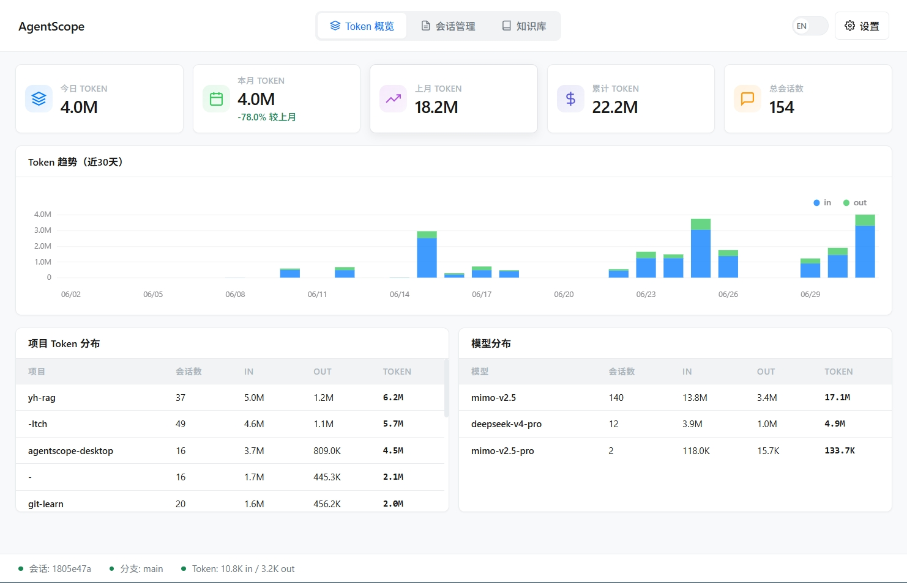

<p align="center">
  <h1 align="center">🔍 AgentScope</h1>
  <p align="center">
    <strong>AI Agent 改了你的代码？3 秒看清全貌。</strong>
  </p>
  <p align="center">
    
    
    
    
    
    
  </p>
</p>

---

## ✨ 这是什么？

**AgentScope** 是一个桌面应用，帮你一眼看清 **AI Agent（如 Claude Code）对代码做了什么**。

### 🎯 解决什么问题？

> *"Claude Code 改了 20 个文件，我根本不知道改了啥..."*

每次用 AI Agent 写代码后，你是不是也有这种感觉？

- 😵 改动太多，`git diff` 看不过来
- 🤔 不知道每个改动对应哪个操作
- ⚠️ 担心 Agent 误删文件或执行危险命令

**AgentScope 帮你解决这些问题。**

---

## 🚀 30 秒开始使用

### 第一步：下载

前往 [Releases](https://github.com/foxpup11/agentscope/releases/latest) 下载：

| 平台 | 文件 | 大小 |
|------|------|------|
| **Windows** | `agentscope-desktop.exe` | ~12MB |

### 第二步：运行

**双击** `agentscope-desktop.exe`，无需安装。

### 第三步：查看

1. 左侧选择一个会话
2. 右侧查看文件改动
3. 点击文件查看 Diff

**就这么简单！**

---

## 界面预览

<p align="center">
  
</p>

---

## 核心功能

| 功能 | 描述 | 版本 |
|------|------|------|
| **会话列表** | 左侧面板展示所有 Claude Code 会话 | v0.1.0 |
| **文件改动** | 显示每个文件的风险等级、变更类型 | v0.1.0 |
| **Diff 预览** | 语法高亮的代码差异查看 | v0.1.0 |
| **风险评估** | 自动标注 Safe / Review / Danger | v0.1.0 |
| **中英文切换** | 支持中英文界面 | v0.1.0 |
| **可拖拽布局** | 拖动调整侧边栏宽度 | v0.1.0 |
| **实时监控** | 自动检测新会话 | v0.2.0 |
| **会话导出** | 支持 HTML/Markdown 格式 | v0.2.0 |
| **Diff 对比** | 支持会话前后对比 | v0.2.0 |
| **设置面板** | 主题切换、自定义规则 | v0.2.0 |
| **深色主题** | 支持深色/浅色/跟随系统 | v0.2.0 |
| **项目分组** | 会话按项目分组显示 | v0.2.1 |

---

## 风险评估

AgentScope 自动评估每个改动的风险等级：

| 等级 | 触发条件 | 示例 |
|------|----------|------|
| **Danger** | 删除文件、敏感文件、危险命令、大量改动 | `.env`, `rm -rf`, 删除操作 |
| **Review** | 删除代码、修改依赖、多次编辑 | `go.mod`, `package.json` |
| **Safe** | 新增文件、小改动、文档修改 | `README.md`, `docs/` |

### 自定义规则

你可以在设置面板中添加自定义风险规则：

- 支持文件路径模式匹配
- 可设置风险等级 (Safe/Review/Danger)
- 可启用/禁用单个规则

---

## 更新日志

### v0.2.1 (2026-06-30)
- ✅ 会话列表按项目分组显示，支持折叠/展开
- ✅ 窗口标题显示版本号
- ✅ 修复删除文件检测问题

### v0.2.0 (2026-06-30)
- ✅ 实时监控新会话
- ✅ 会话导出 (HTML/Markdown)
- ✅ Diff 对比功能
- ✅ 设置面板 (主题、自定义规则)
- ✅ 深色主题支持

### v0.1.0 (2026-06-29)
- ✅ Claude Code 会话解析
- ✅ 文件改动列表
- ✅ Diff 语法高亮
- ✅ 风险等级评估
- ✅ 中英文切换

---

## Roadmap

- [x] Claude Code 会话解析
- [x] 文件改动列表
- [x] Diff 语法高亮
- [x] 风险等级评估
- [x] 中英文切换
- [x] 可拖拽分隔栏
- [x] 实时监控新会话
- [x] 会话导出 (HTML/Markdown)
- [x] 设置面板
- [x] 深色主题
- [x] 项目分组
- [ ] 支持 Codex CLI
- [ ] 支持 OpenCode
- [ ] 支持 Aider
- [ ] 多语言支持扩展

---

## 从源码构建

```bash
# 前置要求
# - Go 1.21+
# - Wails CLI: go install github.com/wailsapp/wails/v2/cmd/wails@latest

git clone https://github.com/foxpup11/agentscope.git
cd agentscope

# 安装依赖
go mod tidy

# 开发模式
wails dev

# 构建生产版本 (Windows)
wails build -platform windows/amd64 -o agentscope-desktop.exe
```

---

## 项目结构

```
agentscope/
├── main.go                          # 应用入口
├── app.go                           # 主应用逻辑
├── frontend/                        # 前端代码
│   ├── index.html                   # 页面结构
│   ├── app.js                       # 主逻辑
│   ├── style.css                    # 样式
│   ├── i18n.js                      # 国际化
│   └── wailsjs/                     # Wails 绑定
├── internal/                        # 后端逻辑
│   ├── session/                     # 会话解析
│   │   └── claude/reader.go         # Claude Code 解析器
│   ├── diff/                        # Git Diff 处理
│   ├── risk/                        # 风险评估引擎
│   ├── monitor/                     # 文件监控
│   ├── export/                      # 导出功能
│   └── settings/                    # 设置管理
├── docs/                            # 文档
│   ├── BUGS.md                      # BUG 追踪
│   └── CHANGELOG.md                 # 更新日志
└── build/                           # 构建产物
```

---

## Contributing

欢迎贡献！

1. Fork 本仓库
2. 创建特性分支 (`git checkout -b feature/amazing-feature`)
3. 提交更改 (`git commit -m 'Add amazing feature'`)
4. 推送到分支 (`git push origin feature/amazing-feature`)
5. 创建 Pull Request

详见 [CONTRIBUTING.md](CONTRIBUTING.md)。

---

## License

MIT License

---

<p align="center">
  <strong>如果 AgentScope 帮到了你，请给个 Star 支持一下！</strong>
</p>
