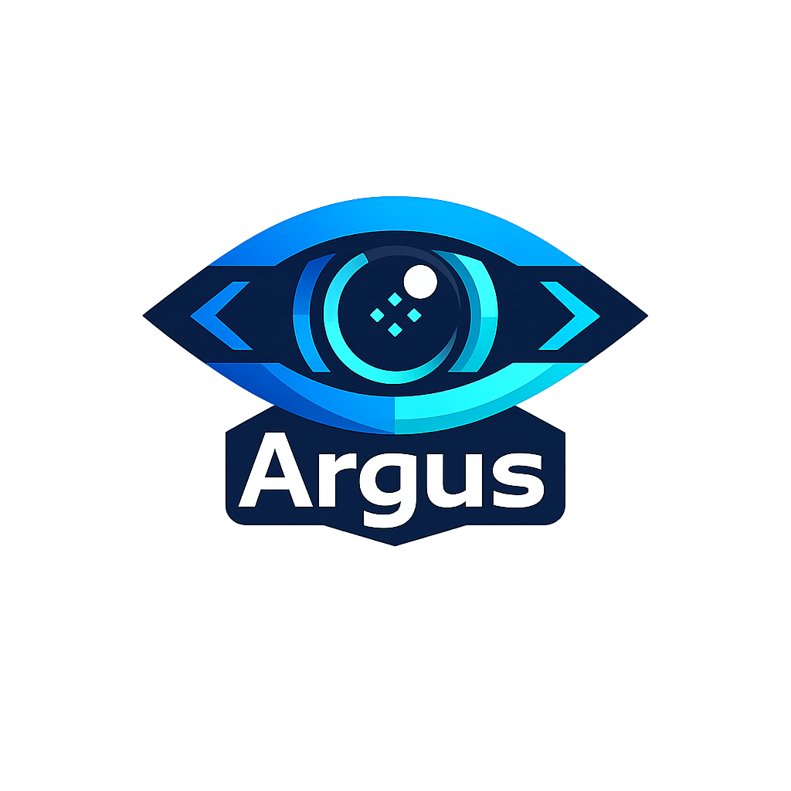
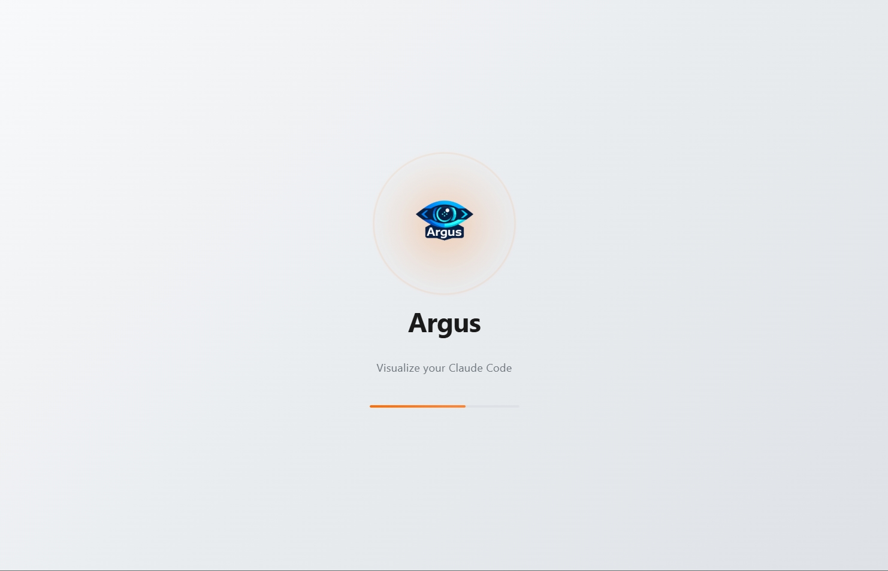
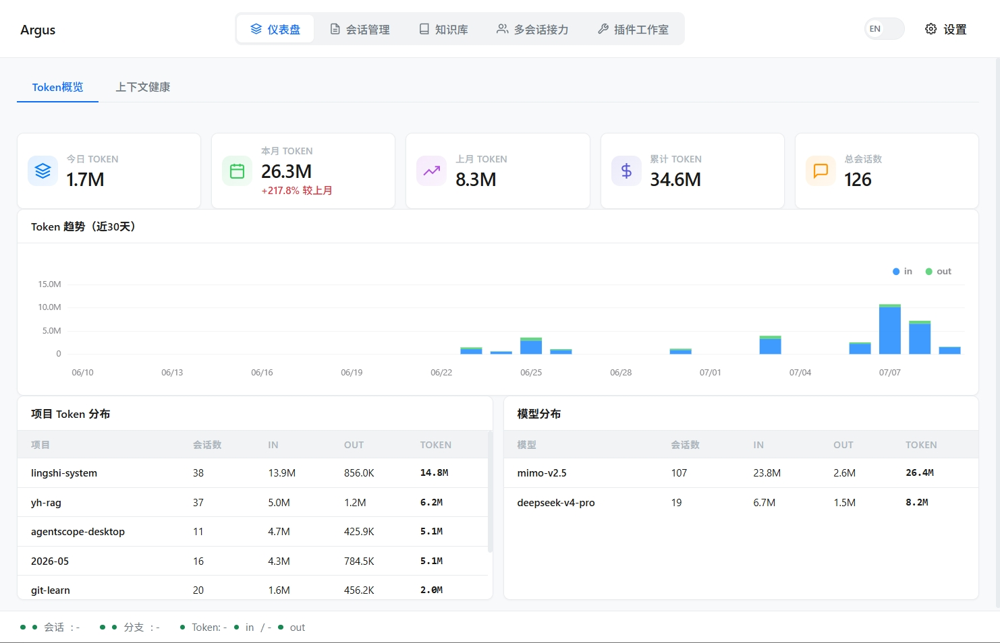
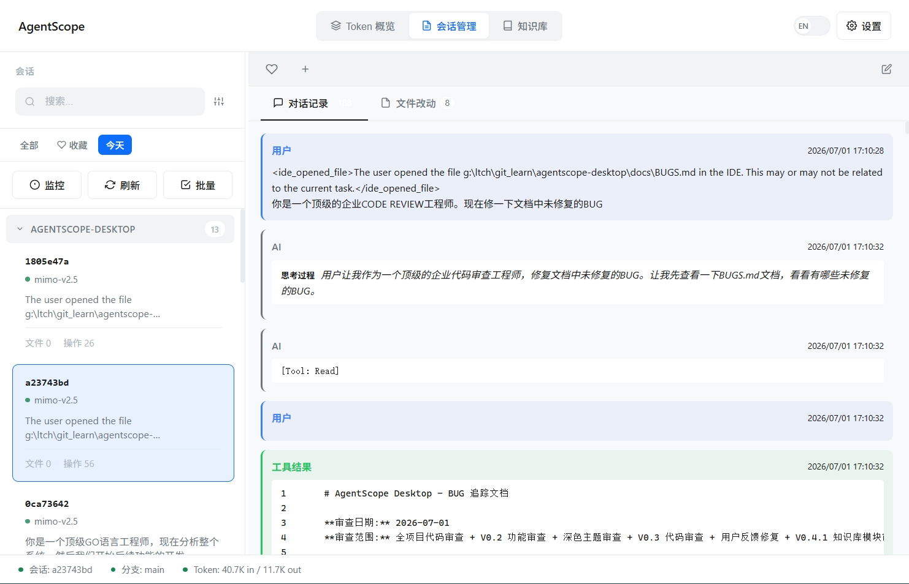
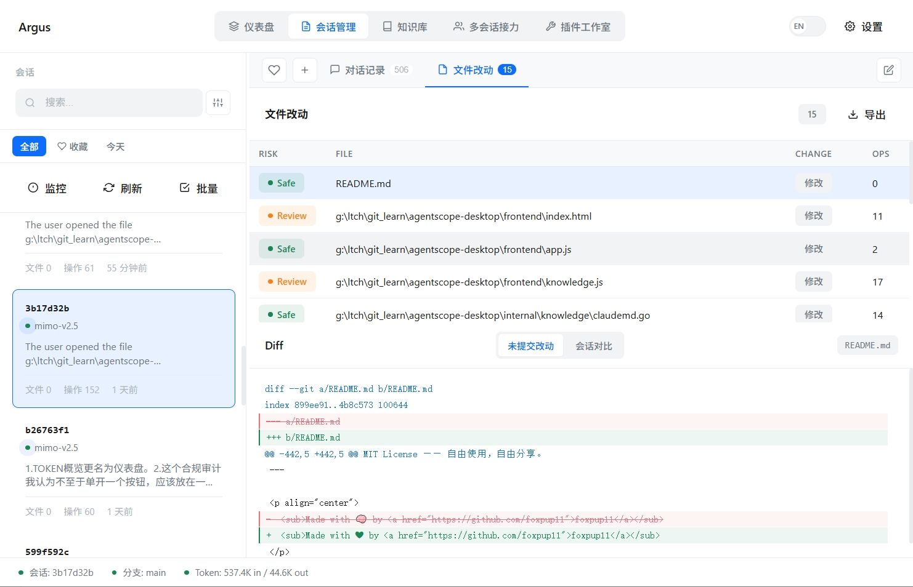
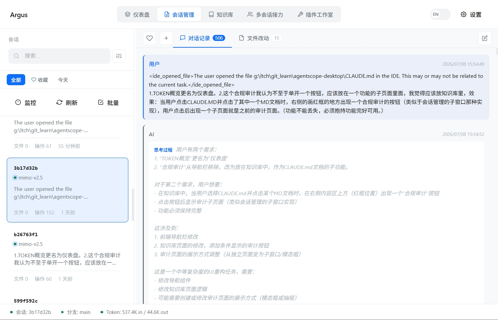
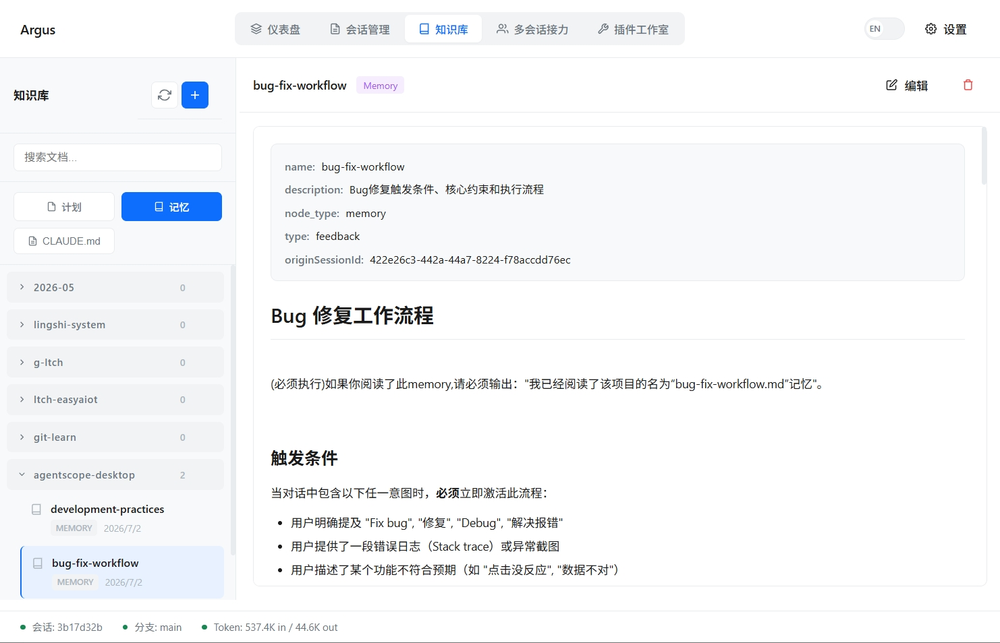

  

<h1 align="center">Argus</h1>

  <strong>百眼守护你的 Claude Code —— 你再也回不去"盲人摸象"的时代了</strong>

  <em>Argus Panoptes，希腊神话中的百眼巨人。即使沉睡，也总有眼睛在守望。 
  这就是 Argus 对你的 Claude Code 所做的——每一个会话、每一次改动、每一分花费，尽收眼底。</em>

  
  
  
  
  

  <a href="https://github.com/foxpup11/argus/releases/latest">📥 下载 (12MB)</a> ·
  <a href="#-你是不是也遇到过这些问题">🎯 看痛点</a> ·
  <a href="#-它能帮你做什么">💡 看方案</a> ·
  <a href="#-为什么选择-argus">🔥 看优势</a>

---

## 你是不是也遇到过这些问题？

> **"每次开新会话，Claude 就像失忆了一样，把昨天做过的事又做一遍。"**

你花了 2 小时教它理解你的项目架构，第二天开新会话，它又从零开始问你"请问你的项目用的是什么技术栈？"

> **"月底账单出来，我才发现 token 消耗比我想的多了 10 倍。"**

你以为只是正常写代码，结果发现 Claude 陷入了循环读取同一个文件的陷阱，3 分钟烧掉了你 5 小时的配额。

> **"Claude 删了我关键文件，我完全不知道，直到 CI 挂了才发现。"**

它静悄悄地把你的配置文件改了、把测试删了，你从头到尾蒙在鼓里。

> **"CLAUDE.md 写了一堆规则，Claude 根本不遵守。"**

你说"先写测试再写实现"，它直接跳过了测试文件。你说"不要改 config"，它把你的 docker-compose.yml 改得面目全非。

**这些问题的根源是同一个：Claude Code 只看得到当前会话，它没有全局视野。**

而 Argus，就是悬在 Claude Code 头顶的一百只眼睛。

---

## 它能帮你做什么？

### 🧠 跨会话连续性 —— 让 Claude "记住"一切

**不再从零开始。** 这是 Argus 的核心能力，也是 Claude Code 自身永远做不到的事。

Argus 自动从历史会话中提取已完成的任务、待办事项、关键决策，用 LLM 增强理解，再拿 Git 记录交叉验证——生成一份标准化的交接摘要。下一次开新会话？直接导入上下文，秒级进入状态。

| 没有 Argus | 有了 Argus |
|------------|-----------|
| 每个新会话都要重新解释项目背景 | 一键导入上次会话的上下文 |
| Claude 重复执行已完成的工作 | 清楚知道什么做完了、什么还没做 |
| "上次已经改了那个 bug" → "哪个？" | 自动列出所有历史修改和决策 |
| 50-75% 时间浪费在"恢复记忆"上 | 零切换成本，直接继续 |

**支持多种导出格式：**
- 📋 粘贴到新会话的 **Prompt 片段**
- 📝 可读的 **Markdown 文档**
- 🧠 自动保存到项目的 **Memory 目录**

### 📊 Token 费用透明 —— 每一分钱花在哪

**你值得知道自己的钱花在了什么上面。**

- **5 张概览卡片**：今日 / 本月 / 上月 / 累计 Token + 总会话数，实时刷新
- **30 天趋势图**：Input + Output 堆叠柱状图，一眼看出哪些天烧得最猛
- **项目维度分析**：按项目分组统计，找到那个"偷吃" token 的元凶
- **模型维度分析**：不同模型的用量占比，帮你优化模型选择
- **月度对比**：本月 vs 上月百分比变化，消费趋势一目了然

### 🛡️ 风险自动评估 —— 你的 AI 操作守护者

**危险操作，一眼识别。** Argus 内置智能风险评估引擎，自动给每次文件改动打分：

| 等级 | 图标 | 触发条件 |
|------|------|---------|
| **Danger** | 🔴 | 删除文件、修改 `.env`、`rm -rf` 命令、安全敏感操作 |
| **Review** | 🟡 | 修改依赖文件、删除代码块、改动配置文件 |
| **Safe** | 🟢 | 新增文件、小幅修改、文档更新 |

支持**自定义风险规则**——按文件路径模式匹配，告诉 Argus 你的项目中哪些文件需要特别关注。

### 📝 文件改动 & Diff —— 每一次修改都清晰可辨

- **完整 Diff 视图**：语法高亮，新增/删除行一目了然
- **两种对比模式**：未提交改动 vs 会话前后对比
- **变更分类**：Created / Modified / Deleted 清晰标注
- **风险标注**：每个文件自动标注风险等级和原因

### 💬 对话回放 —— Claude 的"黑匣子"

**它到底想了什么、做了什么，全都在你眼前。**

- 完整回放：用户消息、AI 思考过程、工具调用链
- 精确到秒的时间戳
- 一键复制命令
- 全文搜索所有历史对话——再也不用翻聊天记录

### 📚 知识库管理 —— 项目记忆永不丢失

**CLAUDE.md、Plans、Memory，集中管理，一键生成。**

- **CLAUDE.md 分节编辑器**：按 Overview / Tech Stack / Conventions / Architecture / Commands 分段编辑，结构清晰、实时预览
- **智能生成器**：自动检测项目语言、框架、构建工具、测试、CI、Docker，一键生成最佳实践配置
- **知识库集中管理**：所有 Plans、Memory、CLAUDE.md 在一个地方，支持搜索、筛选、批量操作
- **多项目切换**：自动发现所有 Claude Code 项目，无缝切换

### 🔌 插件工作室 (Plugin Studio)

**可视化管理 Claude Code 的 Hook 和 MCP 配置。**

- **Hooks 配置**：可视化编辑 Claude Code 事件钩子，支持模板库一键应用
- **MCP 服务器管理**：配置 MCP 协议服务器，支持 stdio 和 SSE 两种传输模式
- **配置验证**：保存前自动验证配置合法性

### ✅ CLAUDE.md 规则遵守审计（LLM 驱动）

**你说的规则，Claude 到底遵守了吗？**

LLM 自动从 CLAUDE.md 提取行为规则，逐会话审计 Claude 是否遵守——检查文件变更、执行命令、对话内容，给出合规评分和违规详情。

| 没有 Argus | 有了 Argus |
|------------|-----------|
| "我说了不要改 config" → CI 挂了才发现 | 自动检测每次违规，生成审计报告 |
| 规则写了等于没写 | 每个会话的合规评分一目了然 |
| 手动逐个检查会话 | LLM 并发审计所有会话，结果缓存复用 |

### 🏥 上下文健康仪表盘 —— 知道何时该开新会话

**Claude 越聊越笨？Argus 帮你量化退化。**

Claude Opus 标称 100 万 token 上下文，但在 ~200K 处就开始出现质量退化。Argus 通过分析每次 API 调用的 input_tokens，估算会话的峰值上下文使用量，给出健康评分和退化预警。

| 功能 | 说明 |
|------|------|
| 峰值上下文估算 | 追踪所有轮次中最大的 input_tokens，估算实际上下文使用量 |
| 健康综合评分 | 基于峰值使用率、压缩事件、思考深度等多维度评分（0-100） |
| 上下文压缩检测 | 自动识别 input_tokens 大幅下降的压缩事件 |
| 退化信号预警 | 峰值 >50% 警告、>80% 危险，提醒你开新会话 |
| 趋势可视化 | 折线图展示多会话的上下文增长趋势，200K 限制线一目了然 |

### 🗂️ 会话管理 —— 你的所有会话，井井有条

- **全文搜索 + 高级筛选**：搜索 Prompt、模型、分支；按标签、收藏状态筛选
- **17 条自动标签规则**：自动识别技术栈、操作类型、领域特征
- **手动标签 + 收藏**：为重要会话打标签、加收藏、写备注
- **批量操作**：批量收藏、导出、删除
- **项目分组**：按项目自动分组，折叠/展开，清爽高效
- **实时监控**：文件系统变化自动捕获，新会话秒级呈现
- **导出**：单条或批量导出为 Markdown / HTML

### 🎨 体验细节

- **三主题切换**：浅色 / 深色 / 跟随系统
- **中英文一键切换**
- **可拖拽布局**：侧边栏、详情面板自由调整
- **零网络依赖**：完全离线运行

---

## 为什么选择 Argus？

### 不止是"工具"，是"守护者"

Argus 的名字来自希腊神话中的百眼巨人 **Argus Panoptes**。赫拉派他看守艾奥——即使睡去，他也总有一部分眼睛睁着，从不完全失去视野。

这就是 Argus 对你 Claude Code 所做的：**即使你不盯着屏幕，它也在帮你盯着 Claude。**

| 维度 | 其他"AI 助手" | Argus |
|------|-------------|-------|
| 位置 | Claude Code 内部插件 | **外部独立进程** |
| 视野 | 只能看到当前会话 | **跨项目、跨会话全局视角** |
| 安全性 | 可能被 Claude 误操作 | **天然隔离，只读不写** |
| 隐私 | 可能需要联网 / API | **完全本地，零网络通信** |

### 零配置，零侵入

- ❌ **不需要安装** —— 一个 12MB 的 exe，双击即用，不写注册表
- ❌ **不需要联网** —— 完全离线运行，你的代码不离开你的电脑
- ❌ **不需要配置** —— 自动扫描 `~/.claude/projects/`，开箱即用
- ⚡ **LLM 增强为可选** —— Token 分析、会话管理等核心功能无需 LLM；合规审计和会话交接摘要可选接入 LLM 以获得更高质量

### 真正的"外部观察者"

Argus 运行在 Claude Code **之外**，这意味着：

- ✅ 能看到 Claude Code 自己看不到的**跨会话全局数据**
- ✅ 不会干扰 Claude Code 的正常工作
- ✅ 安全性天然高于任何"插件"或"扩展"
- ✅ Claude 崩溃、重启、开新会话——Argus 的记录永远都在

### 你的数据，你做主

所有数据存储在本地 `~/.argus/` 目录。Argus 只读取 Claude Code 已经产生的会话文件，**不上传、不分析、不共享你的任何数据**。没有遥测、没有追踪、没有云端。

---

## 功能全景

<strong>🔄 会话连续性引擎</strong>

| 功能 | 说明 |
|------|------|
| 跨会话任务提取 | 从历史会话中自动识别已完成任务、待办事项、关键决策 |
| LLM 语义增强 | 可选接入 LLM 提升提取质量（支持 OpenAI / Anthropic / 本地模型） |
| Git 交叉验证 | 对比 git 记录验证任务是否真正提交，防止"说过了但没做" |
| 文件概览 | 统计每个文件的操作次数和类型（代码/测试/配置） |
| 已知问题发现 | 自动标记反复出现的错误和陷阱 |
| 质量评分 | 完整性 / 准确性 / 时效性 / 综合评分，四维量化 |
| 多种导出 | Memory 文件 / Markdown / 可粘贴 Prompt 片段 |

<strong>📊 Token 仪表盘</strong>

| 功能 | 说明 |
|------|------|
| 5 张概览卡片 | 今日 / 本月 / 上月 / 累计 Token + 总会话数 |
| 30 天趋势图 | Input + Output 堆叠柱状图，支持 Chart.js 交互 |
| 项目维度分析 | 按项目分组统计 Token 消耗 |
| 模型维度分析 | 识别不同模型使用占比 |
| 月度对比 | 本月 vs 上月百分比变化 |

<strong>💬 对话回放 & 工具调用</strong>

| 功能 | 说明 |
|------|------|
| 完整回放 | 用户消息、AI 回复、思考过程（Thinking） |
| 工具调用链 | 展示 AI 调用了哪些工具及其输入输出 |
| 时间戳 | 每条消息精确到秒 |
| 全文搜索 | 搜索所有历史会话的 Prompt 和对话内容 |

<strong>📝 文件改动 & Diff</strong>

| 功能 | 说明 |
|------|------|
| 智能风险评估 | Danger / Review / Safe 自动分级 + 自定义规则 |
| Diff 语法高亮 | 新增/删除行分色显示 |
| 双模式对比 | 未提交改动 / 会话前后对比 |
| 变更类型分类 | Created / Modified / Deleted 清晰标注 |

<strong>📚 知识库管理</strong>

| 功能 | 说明 |
|------|------|
| Plans | 管理 Claude Code 的计划文档 |
| Memory | 管理项目记忆文件 |
| CLAUDE.md 分节编辑器 | Overview / Tech Stack / Conventions / Architecture / Commands 分段编辑 |
| CLAUDE.md 智能生成器 | 自动检测项目结构（语言/框架/构建工具/CI/Docker），一键生成配置 |
| 多项目管理 | 自动发现所有项目，一键切换 |

<strong>🗂️ 会话管理</strong>

| 功能 | 说明 |
|------|------|
| 全文搜索 + 高级筛选 | 搜索 Prompt / 模型 / 分支 / 标签；组合筛选 |
| 17 条自动标签 | 自动识别技术栈、操作类型、领域特征 |
| 手动标签 + 收藏 + 备注 | 三件套管理重要会话 |
| 批量操作 | 批量收藏、导出、删除 |
| 项目分组 | 按项目自动分组，折叠/展开 |
| 实时监控 | fsnotify 驱动的文件变化自动刷新 |

<strong>🔌 插件工作室</strong>

| 功能 | 说明 |
|------|------|
| Hooks 配置 | 可视化编辑 Claude Code Hook 事件，支持模板库 |
| MCP 服务器管理 | 配置 MCP 服务器，支持 stdio / SSE 传输 |
| 配置验证 | 保存前自动校验配置合法性 |

<strong>✅ CLAUDE.md 规则遵守审计</strong>

| 功能 | 说明 |
|------|------|
| LLM 规则提取 | 语义理解 CLAUDE.md，自动提取行为规则（非正则匹配） |
| 会话级审计 | 分析文件变更、执行命令、对话内容，检查规则遵守情况 |
| 合规评分 | 总体分数 + 违规详情（严重程度 + 具体证据） |
| 并发审计 | 最多 3 个 LLM 并发调用，加速批量审计 |
| 结果缓存 | 规则不变时复用缓存，避免重复调用 LLM |
| 导出报告 | 一键导出 Markdown 格式的审计报告 |

<strong>🎨 体验 & 其他</strong>

| 功能 | 说明 |
|------|------|
| 主题 | 浅色 / 深色 / 跟随系统 |
| 自定义风险规则 | 按文件路径模式匹配，精准控制 |
| 导出 | 单条或批量导出为 Markdown / HTML |
| 国际化 | 中文 / English 一键切换 |
| 可拖拽布局 | 面板大小自由调整 |

---

## 预览

---

## 快速上手

### 第一步：下载

前往 [Releases](https://github.com/foxpup11/argus/releases/latest) 下载最新版本。

| 文件 | 大小 | 说明 |
|------|------|------|
| `argus-desktop.exe` | ~12MB | Windows 可执行文件，免安装 |

### 第二步：双击运行

不需要安装，不需要配置，不需要 API Key。双击 `argus-desktop.exe`，直接打开。

### 第三步：开始使用

选择左侧任意会话，即可查看对话记录、文件改动、Token 消耗。

**就这么简单。**

> 💡 **进阶提示**：在设置中配置 LLM（支持 OpenAI / Anthropic / 任何兼容 API），可以解锁**会话交接摘要**和**合规审计**等高级功能。不配置也能用——Token 分析、会话管理、文件 Diff 等核心功能完全离线运行。

---

## Roadmap

### 已完成 (v0.1 – v0.6)

- [x] Claude Code 会话解析与展示
- [x] 文件改动列表与智能风险评估
- [x] Diff 语法高亮（双模式对比）
- [x] 对话记录完整回放（含思考过程 + 工具调用）
- [x] 中英文实时切换
- [x] 可拖拽响应式布局
- [x] 文件系统实时监控
- [x] 会话导出（Markdown / HTML）
- [x] 深色 / 浅色 / 跟随系统主题
- [x] 自定义风险规则引擎
- [x] 按项目自动分组
- [x] Token 仪表盘（5 卡片 + 30 天趋势图 + 双维度分析）
- [x] 全文搜索 + 高级筛选
- [x] 标签系统（手动 + 17 条自动识别规则）
- [x] 会话收藏 + 备注 + 批量操作
- [x] CLAUDE.md 分节可视化编辑器
- [x] CLAUDE.md 智能生成器（项目结构自动检测）
- [x] 知识库集中管理（Plans / Memory / CLAUDE.md）
- [x] **会话连续性引擎**（跨会话任务提取 + LLM 增强 + Git 验证）
- [x] **插件工作室**（Hooks + MCP 可视化配置）
- [x] **CLAUDE.md 规则遵守审计**（LLM 驱动 + 缓存 + 并发审计）
- [x] **上下文健康仪表盘**（峰值上下文估算 + 健康评分 + 退化预警 + 趋势图）

### 进行中 / 计划中

- [ ] **成本异常预警系统** —— Token 消耗速率异常时桌面通知告警
- [ ] **提示词效能分析器** —— 帮你优化 prompt，提升 AI 响应质量
- [ ] **macOS / Linux 支持** —— Wails 天然跨平台，正在适配

详细技术方案见 [docs/ROADMAP.md](docs/ROADMAP.md)。

---

## 技术栈

| 层级 | 技术 | 说明 |
|------|------|------|
| 后端 | Go 1.23 + Wails v2 | 高性能、跨平台桌面框架 |
| 前端 | 原生 HTML/CSS/JS + Chart.js | 零框架依赖，极致轻量 |
| 存储 | 本地 JSON 文件 | 零数据库依赖，数据完全透明 |
| 文件监控 | fsnotify | 实时感知 Claude Code 会话变化 |
| LLM 集成 | 通用 OpenAI 兼容 API | 可选增强，支持任意兼容提供商 |

---

## 贡献

欢迎贡献！无论是提交 Bug、建议新功能，还是直接贡献代码。

1. Fork 本仓库
2. 创建特性分支 (`git checkout -b feature/amazing-feature`)
3. 提交更改 (`git commit -m 'feat: add amazing feature'`)
4. 推送到分支 (`git push origin feature/amazing-feature`)
5. 创建 Pull Request

详细指南见 [CONTRIBUTING.md](CONTRIBUTING.md)。

---

## License

MIT License —— 自由使用，自由分享。

---

  Made with 🧠 by <a href="https://github.com/foxpup11">foxpup11</a>

